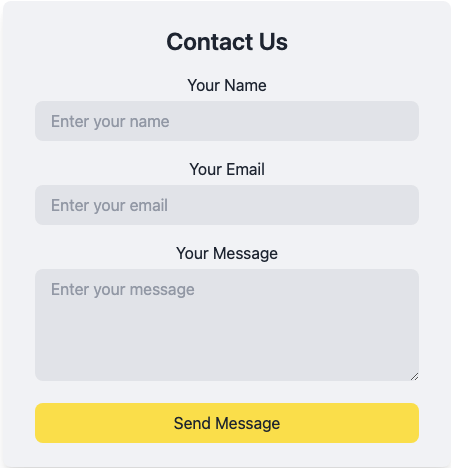

# 📬 Smart Contact Form

Ein modernes, responsives Kontaktformular mit Validierung, Erfolgsmeldung und Email-Versand über EmailJS – ideal für Freelancer, Portfolios oder Unternehmensseiten.

---

## 🚀 Features

- 🧠 Live-Validierung von Name, E-Mail und Nachricht
- ✅ Benutzerfreundliche Fehlermeldungen
- ✉️ Integration mit [EmailJS](https://www.emailjs.com/)
- 🌈 Animierte Erfolgsmeldung nach dem Absenden
- 📱 Fully responsive mit Tailwind CSS
- ⚡ React + Vite für schnelle Entwicklung

---

## 🖼️ Screenshots



---

## 🛠️ Tech Stack

- **Frontend**: React, Vite
- **Styling**: Tailwind CSS
- **E-Mail**: EmailJS
- **Deployment**: Vercel

---

## 🧑‍💻 Lokale Installation

```bash
git clone https://github.com/dein-nutzername/smart-contact-form.git
cd smart-contact-form
npm install
npm run dev
